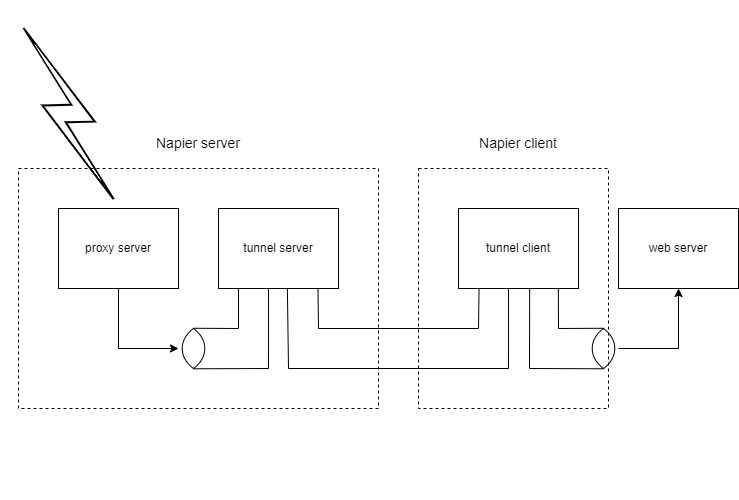
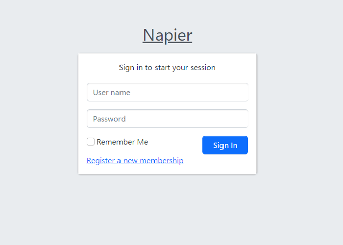
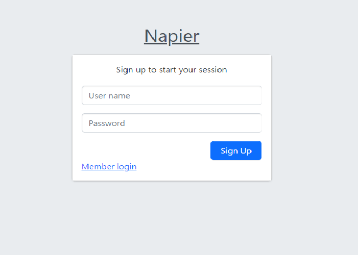

# Napier

Japanese document is [here](README_jp.md)

Napier is on demand proxy system, using websocket.

## Summary

Napier is a reverse proxy system that uses web sockets for forwarding connections.



Therefore, as long as Napier is visible on the network, you can place a proxy destination.

## Structure

When Napier server starts, it opens ports for web (port 80, port 443) and port for forwarding (port 8000).

If the path part of the URL connected to the web port is `/manage`, the web UI for settings will be sent.

For any other URL, search for a forwarding rule corresponding to that URL. If it matches the transfer rule, it will be transferred to that transfer destination.

A forwarding connection is created by a proxy client connecting to a forwarding port. This connection is made by a (secure) web socket.

A proxy client opens a port for local connections and brokers connections to a local web server.

The proxy client has a built-in web server, and when **enabled**, it is possible to publish the specified directory and below via the proxy.

## Quick Start

### Install

No release packages currently exist. So get the source and run it.

```shell
$ git clone https://github.com/waspcojp/napier.git
$ npm update
```
To use Let's Encrypt's automatic certificate renewal feature, you need to patch `node_modules/le-store-certbot` after `npm update`.

For more information, see the `redbird` issue,

[[ERR_INVALID_ARG_TYPE]: The \"data\" argument must be of type string or an instance of Buffer, TypedArray, or DataView #259](https://github.com/OptimalBits/redbird/issues/259)

Modify `node_modules/le-store-certbot/index.js` as follows.

```
/*   ............ around line 288 ................. */
var privkeyArchive = path.join(archiveDir, 'privkey' + checkpoints + '.pem'); 
//var bundleArchive = path.join(archiveDir, 'bundle' + checkpoints + '.pem'); //no longer used

return mkdirpAsync(archiveDir).then(function () { 
 return PromiseA.all([ 
   sfs.writeFileAsync(certArchive, pems.cert, 'ascii') 
 , sfs.writeFileAsync(chainArchive, pems.chain, 'ascii') 
 , sfs.writeFileAsync(fullchainArchive, [ pems.cert, pems.chain ].join('\n'), 'ascii') 
 , sfs.writeFileAsync(privkeyArchive, pems.privkey, 'ascii') 
//, sfs.writeFileAsync(bundleArchive, pems.bundle, 'ascii') // <-- comment this line
 ]); 
}).then(function () { 
 return mkdirpAsync(liveDir); 
}).then(function () { 
```

Just comment out two places.

### Settings

#### Server

```shell
$ cd napier
$ sudo chown root .
$ sudo npm run server
```

The server loads at startup config/server.js.

In addition, in this example, the folder where Napier is placed is `chown`. This is because according to the `npm` specifications, when opening a port with a port number below 1024, it is executed after sudoing to the folder owner (a kind of `suexec`). For more information, Please see the conversation.

[Macos Big Sur port 80 permission denied with root](https://apple.stackexchange.com/questions/413257/macos-big-sur-port-80-permission-denied-with-root)

First of all , please try `config/server-sample.js` to `config/server.js`, using `ln -s` or `mv`.

```javascript
module.exports = {
	HTTP_PORT: 800,
	HTTPS_PORT: 443,
	WS_PORT: 8001,
	LOCAL_PORT_RANGE: [9000, 9100],
	APPL_PORT: 3010,
	MY_DOMAIN: 'napier-net.com',
	MY_HOST: 'www.napier-net.com',
	home: process.env.HOME,
	session_ttl: 3600 * 24 * 7,
	session_path: `${process.env.PWD}/sessions`,
	cert_path: `${process.env.PWD}/certs`,
	content_path: `${process.env.PWD}/../napier-web`,
	makeDefaultPath: (domain, user) => {
		return  `${user.name}.${domain}`;
	}
};
```

Of these, `MY_DOMAIN` and `MY_HOST` must be modified. Others can be left as they are if there is no particular inconvenience.

To use https, you need a certificate. self-signed certificate is fine if you just try it locally, but you need to get it correctly to put it globally. In the case of default setting `./cert`, certificate and private key appear directly under it. This part is complicated for a "quick start", so I'll explain it later.

If you allow only https connection, `HTTP_PORT` is not required. Similarly, if you allow connections only with http, `HTTPS_PORT` is not required.

### Create account

**Note** There is no default account.

Once the server is up and ready to connect, create an account.

`www.${MY_DOMAIN}/manage` When accessing in non-login state ,



Click 'Register a new membership'.



Currently, there is no such thing as e-mail authentication. It will be registered as is.

### Client

To connect the client,

```shell
$ npm run cli -- <options>
```

Run like The boot options are:

```
Usage: napier-cli [options] [profileName]

Arguments:
  profileName                        profile name (default: "default")

Options:
  --config <config filename>         config file
  --user <user>                      user name
  --password <password>              password
  --url <URL>                        server URL
  --local-port <localPort>           local port
  --re-connect                       re-connect server
  --web-server                       start web server
  --server-config <config filename>  web server config file
  --document-root <path>             web server document root
  --index                            list index
  --markdown                         markdown SSR
  --javascript                       server side Javascript execution
  --authenticate                     password authentication
  -h, --help                         display help for command
```

Of these, the ones that must be specified are `--user`, `--pass` and `--url`.

Options specified on the command line are

```javascript
{
    "host": "www.napier-net.com",
    "localPort": 4001,
    "reConnect": true,
    "webServer": false,
    "user": "****",
    "pass": "****",
    "documentRoot": "."
}
```

It is also possible to store it in a file and `--config` specify it with.

At the end of the command line is the "profile" specification, which will be explained later. If not specified, it will be the default, but the URL where the proxy is started at this time is

```
(http|https)://<user name>.<HOST_NAME>/
```

(This naming convention is customizable)

`--web-serve` rwill start the embedded web server. `--document-root` A web server is started with the directory specified in , as the document root, and can be accessed from outside via the proxy.

## demo site

We've created a [Napier-NET](https://www.napier-net.com), so you can try it without setting up a server.

You can try it by starting the client after accessing the site and registering as a user.

## Commentary

### About certificates

The files to be placed in certs are as follows.

* `${MY_DOMAIN}-cert.pem`

  It's called a certificate. This uses the one containing the intermediate certificate. For Let's Encrypt, it's `fullchain.pem`.

  Please note that if you use a certificate that does not include an intermediate certificate, it will cause a situation where "there is no problem with the web, but the web socket cannot be connected".

* `${MY_DOMAIN}.pem`

  This is the private key.

Note that if a route containing a certificate is started at runtime, a certificate pair named `{number}-cert.pem`, `{number}.pem` will be placed in this directory. Since these create an entity from the database each time they start, there is no problem even if you delete them if you think they are in the way.

### About the contents of the file specified by `--config`

You can put startup parameters in the file specified with `--config`.

This file is in the form of a Common JS module.

Below is the content of the rooted `config/server-sample.js` for reference.

```
module.exports = {
	HTTP_PORT: 80,
	HTTPS_PORT: 443,
	WS_PORT: 8001,
	LOCAL_PORT_RANGE: [9000, 9100],
	APPL_PORT: 3010,
	MY_DOMAIN: 'napier-net.com',
	MY_HOST: 'www.napier-net.com',
	home: process.env.HOME,
	session_ttl: 3600 * 24 * 7,
	session_path: `${process.env.PWD}/sessions`,
	cert_path: `${process.env.PWD}/certs`,
	content_path: `${process.env.PWD}/../napier-web`,
	makeDefaultPath: (domain, user) => {
		return  `${user.name}.${domain}`;
	}
};
```

Each parameter is described below.

<dl>
	<dt>HTTP_PORT</dt>
  <dd>
    <p>Specifies the port number used for HTTP.</p>
    <p>If not specified, HTTP is not used.</p>
    <p>You can specify any port number, but you shouldn't need to specify anything other than <code>80</code> unless you're trying it locally.</p>
  </dd>
	<dt>HTTPS_PORT</dt>
  <dd>
    <p>Specifies the port number used for HTTPS.</p>
    <p>If not specified, HTTPS is not used.</p>
    <p>You can specify any port number, but you shouldn't need to specify anything other than <code>443</code> unless you're trying it locally.</p>
  </dd>
	<dt>WS_PORT</dt>
  <dd>
    <p>Specify the web socket port number for the tunnel to which the proxy client connects.</p>
    <p>Any port number can be specified.</p>
  </dd>
	<dt>LOCAL_PORT_RANGE</dt>
  <dd>
    <p>Specifies the port range used to connect the proxy client tunnels and proxies.</p>
    <p>It is a <code>Array</code> with two elements. The first element is the lower bound and the second element is the upper bound. Port numbers in this range are used.</p>
    <p>This port is used for each new proxy destination, so this number is the number of proxies you can <code>start</code> at the same time.</p>
    <p>The number itself has no particular meaning, so you can arbitrarily specify a range that does not conflict with other ports used.</p>
  </code>
  <dt>APPL_PORT</dt>
  <dd>
    <p><code>/manage</code> The port number on which the web service below is invoked.</p>
    <p>This by itself has no bearing on how your application works, but if it conflicts with a port used by another application, specify another number.</p>
  </dd>
	<dt>MY_DOMAIN</dt>
  <dd>
    <p>This is the domain name that operates the Napier service.</p>
    <p>It doesn't matter what domain you choose, but if you're going to use a subdomain that's given to users, it's often convenient to use a domain dedicated to the Napier service that isn't used by other web services.</p>
  </dd>
  <dt>MY_HOST</dt>
  <dd>
    <p>The host name of the server that operates the Napier service.</p>
    <p>It is used for the process of issuing subdomains to users.</p>
  </dd>
	<dt>cert_path</dt>
  <dd>
    <p>Specify the path name of the folder where the certificate is placed.</p>
    <p>If it is not specified, you cannot wait with HTTPS. The tunnel will also be a plaintext web socket.</p>
    <p>Normally the <code>`${process.env.PWD}/certs`</code> in the sample should be fine.</p>
  </dd>
  <dt>content_path</dt>
  <dd>
    <p>Specifies the folder that contains the content displayed when <code>MY_HOST</code> is accessed.</p>
    <p>Although it is not directly related to the operation of Napier, it is better to prepare contents such as explanations.</p>
  </dd>
	<dt>session_path</dt>
  <dd>
    <p>A folder that stores session information for <code>/manage/</code>.</p>
  </dd>
	<dt>session_ttl</dt>
  <dd>
    <p>Sets the lifetime of session information (in seconds).</p>
    <p>Normally, it should be fine to leave it as a sample.</p>
  </dd>
	<dt>home</dt>
  <dd>
    <p>Specifies the home directory in which the process runs.</p>
    <p>Normally, it should be fine to leave it as a sample. In other words, I haven't checked whether it works without problems other than the sample.</p>
  </dd>
  <dt>makeDefaultPath</dt>
  <dd>
    <p>Defines a function that generates a routing pathname for the user's default profile.</p>
    <p>Normally, there should be no problem with the sample, so please leave it as it is. In this case, the subdomain will be issued.</p>
    <p>If you want to make other payouts, please consider looking at the source code.</p>
  </dd>
</dl>
